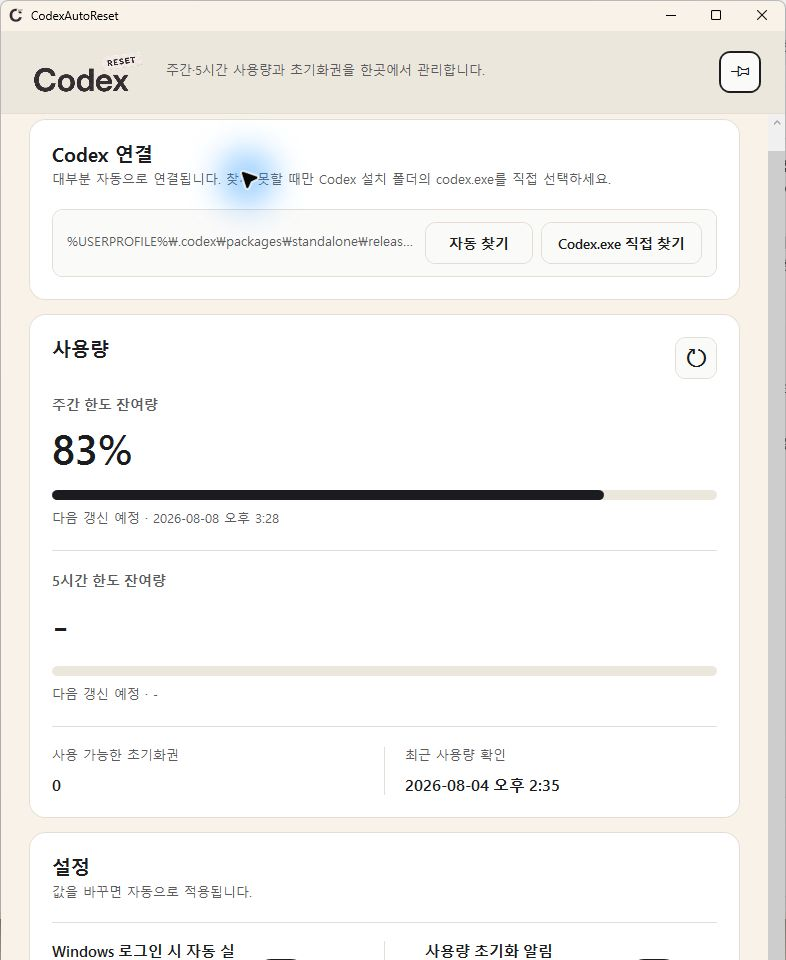

# CodexAutoReset

CodexAutoReset은 Codex의 주간·5시간 사용량을 확인하고, 사용자가 자동 사용을
켠 한도의 잔여량이 설정값 이하가 되면 보유한 초기화권 1개를 **자동으로 사용**하는
Windows 트레이 앱입니다. 자동 사용은 한도별로 따로 켜고 끌 수 있습니다.

> 새로 설치하면 주간·5시간 자동 사용은 모두 꺼져 있습니다. 사용자가 직접
> 켜기 전에는 사용량만 확인하며 초기화권을 사용하지 않습니다.

[Windows 설치 파일](../../releases/latest/download/CodexAutoReset-Setup-x64.exe)
· [Portable ZIP](../../releases/latest/download/CodexAutoReset-Portable-x64.zip)
· [SHA-256 확인값](../../releases/latest/download/SHA256SUMS.txt)

<p align="center">
  
</p>

이 프로젝트는 OpenAI가 제작·지원·보증하는 공식 제품이 아닙니다. Codex 인증
파일을 직접 읽거나 저장하지 않습니다.

## 주요 기능

- 주간·5시간 한도의 잔여량과 다음 갱신 시각, 보유 초기화권 표시
- 한도별 잔여량 기준과 초기화권 자동 사용 On/Off 설정
- 주간 사용량의 정기 초기화, 예정보다 이른 초기화, 앱의 초기화권 사용을 팝업으로 알림
- 1분마다 자동 확인하고 필요할 때 즉시 새로고침
- 트레이 실행, Windows 로그인 시 자동 실행, 창 고정 핀

## 만든 이유

사용량과 초기화권을 매번 직접 확인하는 번거로움을 줄이기 위해 만들었습니다.

## 설치

64비트 Windows 10 버전 1809 이상이 필요합니다. Codex에 정상적으로 로그인되어
있고 Windows용 `codex.exe`가 설치되어 있어야 합니다. 설치 파일에는 .NET
런타임이 포함되어 있어 개발 도구나 관리자 권한은 필요하지 않습니다.

1. 위의 **Windows 설치 파일**을 다운로드합니다.
2. `CodexAutoReset-Setup-x64.exe`를 실행합니다.
3. 설치를 누르면 완료 후 앱이 자동으로 실행됩니다.

유료 코드 서명을 사용하지 않으므로 SmartScreen에서 `알 수 없는 게시자` 경고가
표시될 수 있습니다. 반드시 이 저장소의 Release에서 받은 파일인지 확인하세요.
확인이 필요하면 PowerShell의
`Get-FileHash .\CodexAutoReset-Setup-x64.exe -Algorithm SHA256` 결과를 함께
제공되는 `SHA256SUMS.txt`와 비교할 수 있습니다.

## 처음 설정

1. **Codex 연결**에 올바른 `codex.exe` 경로가 표시되는지 확인합니다.
2. 주간·5시간 한도에 원하는 잔여량 기준을 각각 입력합니다.
3. 자동 사용하려는 한도의 스위치만 켭니다.
4. 필요하면 **Windows 로그인 시 자동 실행**과 **사용량 초기화 알림**을 설정합니다.

설정은 별도 저장 버튼 없이 바로 적용됩니다. 첫 실행 시 두 임계값은 공란,
두 자동 사용과 Windows 자동 실행은 꺼짐이며 사용량 초기화 알림은 켜짐입니다.

자동 사용을 켜는 순간 현재 잔여량이 이미 기준 이하라면 초기화권 1개가 바로
사용될 수 있습니다. 임계값은 한도별로 0~99%에서 설정합니다. 공란 상태에서
자동 사용을 켜면 0%가 적용되고, 임계값을 지우면 해당 자동 사용도 꺼집니다.

### 알아둘 점

- 계정에 5시간 한도가 없으면 `-`로 표시되며 해당 조건은 동작하지 않습니다.
  나중에 한도가 제공되면 자동으로 인식합니다.
- 주간·5시간 스위치는 초기화권을 사용할 조건을 구분합니다. 실제로 어떤 한도가
  초기화되는지는 Codex 서버가 결정합니다.
- 두 조건이 동시에 충족돼도 초기화권 요청은 하나로 합칩니다.
- 같은 Codex 계정의 자동 사용은 한 대의 PC, 한 Windows 사용자에서만 켜는 것을
  권장합니다. PC별 중복 방지 기록은 서로 공유되지 않습니다.

## 평소 사용

- 창의 X를 누르면 종료되지 않고 트레이로 숨겨집니다.
- 트레이 아이콘을 더블클릭하면 창이 다시 열리고, **종료**를 누르면 완전히 끝납니다.
- 새로고침 버튼은 주간·5시간 사용량을 즉시 다시 확인합니다.
- 초기화 알림은 X로 확인할 때까지 유지되며 트레이에서 다시 열 수 있습니다.
- 우상단 핀을 켜면 실행 중인 창을 다른 창보다 위에 유지합니다.

## Portable, 업데이트와 삭제

설치 없이 사용하려면 Portable ZIP을 완전히 압축 해제한 뒤 폴더 안의
`CodexAutoReset.exe`를 실행하세요. EXE만 따로 꺼내면 실행되지 않습니다.
폴더를 옮길 때는 Windows 자동 실행을 먼저 끄고 새 위치에서 다시 켜세요.

업데이트는 앱을 트레이에서 종료한 뒤 새 설치 파일을 실행하면 됩니다. 기존 설정과
중복 사용 방지 기록은 유지됩니다.

설치본은 Windows 11의 **설정 → 앱 → 설치된 앱**, 또는 Windows 10의
**설정 → 앱 → 앱 및 기능**에서 CodexAutoReset을 선택해 제거합니다. 제거할 때
설정과 안전 기록도 지울지 묻습니다. 기본값인 **아니요**는 데이터를 남기고,
**예**는 `%LocalAppData%\CodexResetGuard`와 앱 전용 정보를 영구 삭제합니다.

Portable 폴더만 삭제해도 설정과 안전 기록은 남습니다. 데이터 폴더는 설치본과
Portable이 함께 사용하므로 모든 복사본을 종료한 뒤에만 삭제하세요.

## 동작 원리와 안전장치

1. 로컬 `codex app-server`의 `account/rateLimits/read`로 사용량을 1분마다
   확인합니다. 모델에 프롬프트를 보내지 않으므로 생성 토큰을 사용하지 않습니다.
2. 켜 둔 한도가 임계값 이하이고 초기화권이 있으면
   `account/rateLimitResetCredit/consume`을 호출합니다. 토큰은 쓰지 않지만
   초기화권 1개는 실제로 사용할 수 있습니다.
3. 요청 전에 로컬 상태를 저장하고, 처리 결과와 사용량 회복을 확인할 때까지 다음
   요청을 막습니다. 정기 초기화가 임박했거나 외부 초기화를 감지한 경우에도 기다립니다.
4. 검증되지 않은 응답 형식 변화가 확인되거나 처리 결과가 불명확하면 자동 사용을
   중단하고 호환성 경고를 표시합니다.

## 개인정보와 보안

- `auth.json`, 토큰, 쿠키를 직접 읽거나 저장하지 않습니다.
- 인증은 사용자가 로그인한 로컬 `codex app-server`에 맡깁니다.
- 일시적으로 필요한 초기화권 식별자는 Windows DPAPI CurrentUser로 보호합니다.
- 로그에는 허용된 상태와 숫자만 기록하며 이메일, 계정·초기화권 식별자, 원본
  프로토콜, 사용자 폴더 경로를 남기지 않습니다.
- 설정과 안전 기록은 `%LocalAppData%\CodexResetGuard`에 저장합니다. 기존 버전과의
  호환성을 위해 이전 폴더 이름을 유지합니다.

## 문제가 생겼을 때

**Codex를 찾을 수 없음:** 먼저 **자동 찾기**를 누르고, 계속 찾지 못하면
**Codex.exe 직접 찾기**로 공식 Codex 설치 폴더의 파일을 선택하세요. Codex CLI가
없다면 [공식 Codex CLI 안내](https://learn.chatgpt.com/docs/codex/cli)를 확인하세요.

**초기화권 자동 사용이 안전 차단됨:** 자동 사용을 끄고 CodexAutoReset과 Codex를
최신 상태로 확인하세요. 이유를 확인하지 않고 안전 기록을 삭제하면 중복 요청 위험이
있습니다.

**Windows가 실행을 막음:** 파일명과 다운로드 출처를 확인하고, 출처나 SHA-256이
일치하지 않으면 실행하지 마세요.

## 소스에서 빌드하기

.NET 8.0.423 SDK가 필요합니다.

```powershell
dotnet restore CodexAutoReset.sln --locked-mode
dotnet build CodexAutoReset.sln -c Release --no-restore
dotnet test CodexAutoReset.sln -c Release --no-build
dotnet format CodexAutoReset.sln --no-restore --verify-no-changes
```

설치 파일과 Portable ZIP은 Inno Setup 6.7 이상을 설치한 뒤
`.\scripts\build-release.ps1`로 만들 수 있습니다.

## 라이선스

소스 코드는 [Apache License 2.0](LICENSE)으로 배포합니다. Windows 패키지에는
.NET 런타임 라이선스와 제3자 고지문도 포함됩니다.
